# Die Welt voller Design Thinking - Integration von Design Thinking in unsere Welt
Wir leben in einer Welt voller komplexer und komplizierter Abläufen, die sich gegenseitig beeinflussen und somit Systeme entstehen. Unternehmen und soziale Konstrukte wachsen so schnell wie noch nie und durch die rasche Änderung unserer Gesellschaft durch Globalisierung braucht es konstant geschickte Entscheidungen, um sich an rasche Änderungen anpassen zu können. In unserer digitalen Welt geht nicht darum sich in eine Situation einzubauen - viel mehr geht es darum sich an die Änderung der Situation anzupassen. Design Thinking ist nicht klar definiert. Klar ist aber, dass es um Nutzen von Kreativität geht, um die großen Probleme unserer Zeit zu lösen. Die Lösung der Problemstellung steht im Vordergund. Es ist eine Idee, Methode und Strategie, die Welt aus neuen Blickwinkeln zu betrachten und so komplexe Konzepte zu durchschauen. Es ist kein einfacher Weg, noch ist es ein Weg der immer funktioniert, aber doch scheint Design Thinking seine Relevanz uns seinen Einfluss in der heutigen Welt bestätigen zu können.

# Organisationen und Design Thinking
Wenn es darum geht, durchwachsene Organisationen solide auzubauen, ist es wichtig, eine der Kernchallenges zu verstehen, um darauf zielgerechte Lösungsstrategien anzuwenden. Unternehmen setzen sich in der Regel das Ziel zu skalieren, was durch Produktinnovation und Prozessoptimierung aus -ausfahrung funktioniert. Auf der einen Seite gilt es neue Produkte für zeitrelevante Probleme zu finden - andererseits geht es aber genauso darum, bestehende Produkte und Abläuft so zu verbessern dass sie zu einer besseren Gewinnstellung und zu einem konstanten Wachstum des Unternehmens führen. Zusammengefasst geht es also um:
- **analytisches Denken** (Prozessoptimierung)
- **kreatives Denken** (Produktinnovation und organisationelle Innovation - Wandlung und Chancen)

McDonald's als Beispiel für organisationelle Revolution:
Das amerikanische Burgerunternehmen hat klein begonnen. Die Köche haben gekocht wie in jedem anderen Burgerunternehmen auch. Doch McDonald's fand einen großen Kundenstrom, der die Basis für seine Skalierung und Expansion war. Unter anderem wegen dem Franchise-Modell hatte McDonald's Erfolg. Wenn man das Beispiel klarer betrachte, so fällt auf dass es einige Faktoren gab, die maßgeblich zu seinem Erfolg beigetragen haben:
- Prozesse, wie das Kochen von Burgern wurde so stark standatisiert, dass Köche keinen Spielraum für Fehler oder andere individuelle Änderungen mehr hatten, was zugleich bedeutet, dass die KundInnen immer den selben Burger bekommen
- Durch kreatives Denken wurden neue Abläufe und Produkte geschaffen

Dieses Beispiel zeigt, dass ein Unternehmen also auf zwei Pfeilern aufgebaut werden sollte, um zu skalieren und Innovation voranzutreiben. Die erste Säule, analytisches Denken, stellt einen quantitativen Prozess dar, der zielgerichtet jegliche Form von Veränderungen und Variation eliminiert. Die zweite Säule, kreatives Denken, beschreibt grundlegende Denkweisen nach den Prinzipien des Design Thinkings - es handelt sich um eine intrinsische und kreative Suche nach Innovation. 

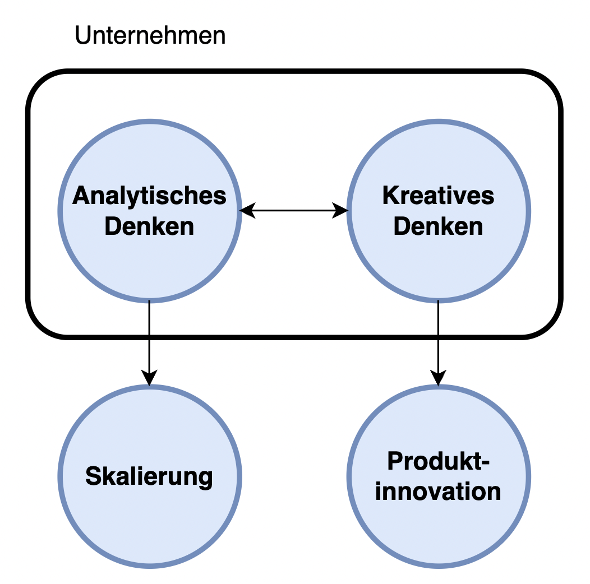

# Der Knowledge Funnel
Da beide Denkweisen (analytisch und kreativ) substanziell für Unternehmen sind, sollten sie praktiziert werden. Der Knowledge-Funnel ist eine schematische Darstellung der Wissensgenerierung in einem Unternehmen und bildet die Transformation von Problemen zu strukturierten und ablaufsorientierten Lösungen ab:

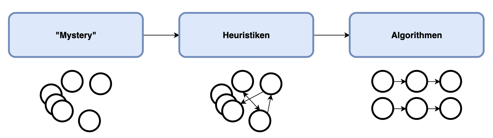

Bei dem Knowledge Funnel handelt es sich um einen iterativen und sich wiederholenden Prozess, der folgende Phasen beinhaltet:

- **"Mystery"**: Hier geht es darum, das ursprüngliche Problem anzugreifen und durch erste Recherche und Studien, Wissen daraus zu generieren. Dieses Wissen ist stark unstrukturiert.
- **Heuristiken**: Um das Wissen der letzten Phase nutzen zu können, müssen Strukturen und andere Zusammenhänge in dem generierten Wissen gefunden werden. Daraus entstehen wage Daumenregeln, die aber das Wissensspektrum auf die relevanten Informationen beschränken.
- **Algorithmen**: Um das Problem zu vereinfachen, werden die zuvor gewonnnen Heuristiken nun in klar definierten Abläufe (= Alogrithmen) transformiert, sodass man das generierte Wissen ausschöpft und daraus praktikable Strukturen gewinnt, die auf die Organisation angewandt werden können.

Die Kraft dieses Werkzeugs zeigt sich in seiner Anwendbarkeit. Unternehmen können in jeglichen Bereichen Wissen generieren und daraus Algorithmen entwerfen, die sich anbieten und komplex sind. Generell gibt es zwei Domains, in denen stetig Innovation vorangetrieben werden kann:

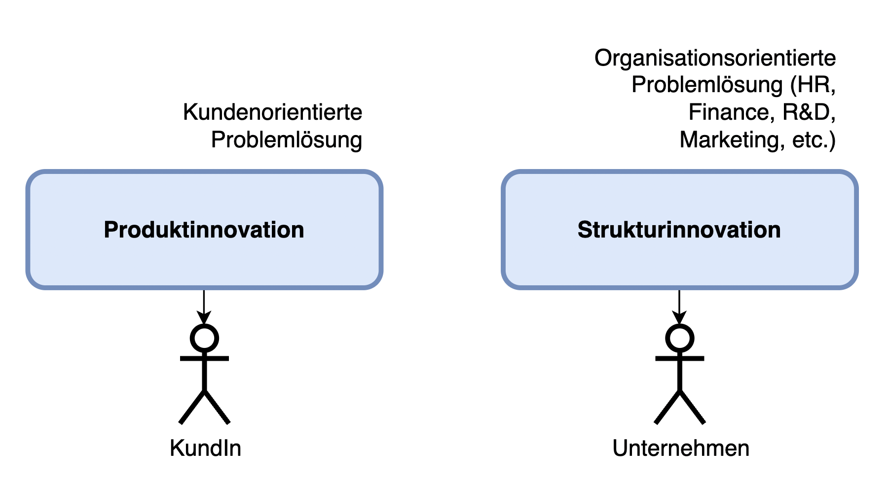

Beispiele:

- **Produktinnovation**: Neue Produkte werden entworfen oder bestehende Produkte werden verbessert
- **Strukturinnovation**: Innovation organisationelle Abläufe in verschiedenen Abteilungen (veraltete Denkweise) und Teams (neue Denkweise); häufig sind genaue Algorithmen nicht das Ziel - vielmehr geht es daraum, neue wissenschaftliche Erkenntnisse zu erhalten

Dementsprechend, können sich Unternehmen zeitgleich in verschiedenen Knowledge Funnels befinden, um maximalen Mehrwert für die KundInnen und die Organisation zu bringen:

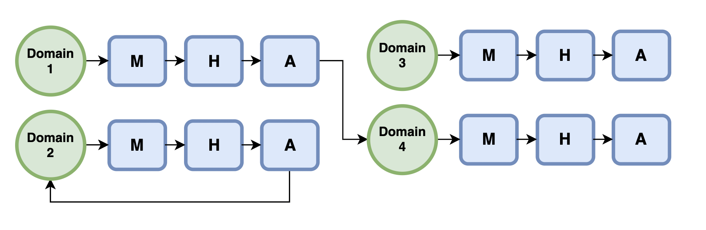

## Exploration und Exploitation
Viele Unternehmen durchlaufen den Knowledge Funnel nur einmal, was den Spielraum für Innovation stark einschränkt. Wenn ein Produktfeld gefunden wird, beginnt das Unternehmen mit der Aufstellung und Prüfung von Hypothesen, bis ein Produk geschaffen wurde, das dies alles erfüllt. Bleibt man nun stehen und agiert nur noch auf Basis von bestehenden Produkten, indem man sie weiter entwicklet, lässt man den Markt häufig aus der Sicht. Vielleicht ergeben sich neue Märkte und neue Produkte. Um diese und andere Fragen zu beantworten, muss man wieder Wissen generieren und kreativ Denken - also: den Knowledge Funnel mehrmals durchlaufen.

Im Knowledge-Funnel ist es wichtig, von einer Phase in die nächste (oder gegebenenfalls zurück) zu iterieren. Dabei sollte in jeder Phase möglichst genau agiert werden, um das nötige Wissen zu erhalten. Der Management Theoretiker **James March** hat hierfür einen Ansatz entwickelt, der dies beschreibt. Er unterscheidet zwischen Wissens-Generierung (Exploration) und Wissens-Nutzung (Exploitation):

- **Exploration**: Suche nach neuem Wissen
- **Exploitation**: Bestehendes Wissen vesbessern und implizites (= abgeleitetes) Wissen schaffen während man sich in einer Knowledge-Phase befindet

Viele erfolgreiche Organisationen befinden sich stätig in beiden Phasen, um auf der einen Seite neue Ideen zu finden und andererseits Bestehendes zu vesbessern.

Unterschiede zwischen Exploration und Exploitation:

| Charakterisik | Exploration                                      | Exploitation                                             |
|---------------|--------------------------------------------------|----------------------------------------------------------|
| Fokus         | Ideenfindung                                     | Aministration                                            |
| Ziel          | Von einer Knowledge-Phase zur nächsten iterieren | Wissen verbessern und ableiten; in einer Knowledge-Stage |
| Werkzeuge     | Intuition, Kreativität, Hypothesen               | Analyse, historische Daten                               |
| Orientierung  | Zukunft                                          | Vergangenheit und Gegenwart                              |
| Limitationen  | -                                                | Aktuelles Wissen                                         |
| Risiko        | groß und unberechnbar                            | gering und berechenbar                                   |
| Value         | enorm                                            | gering                                                   |

Dies zeigt, dass die Exploration Phase zwar risikoreicher ist, aber im Erfolgsfall einen enorm positiven Einfluss auf die Organisartion hat.

Beispiel hierfür: Eine Bäckerei verkauft Brot. Die Suche nach einer alternativen Brotsorte ist risikoreich. Wird sie aber gefunden, hat das neue Produkt enormes Erfolgspotential und völlig neue Märkte werden erschlossen. Versucht die Bäckerei hingegen bestehende Produkte stetig zu vesbessern, so ist dies nicht so risikoreich. Schafft sie es, Brotsorten zu verbessern, kann es sein, dass das Brot öfter gekauft wird - neue Märkte werden jedenfalls nicht erschlossen.

## Ausgangshypothese
Wenn Innovation in einem Bereich vorangetrieben werden soll, dann ist es wichtig, eine Ausgangshypothese zu haben, um das dahinter liegende Problem effektiv zu lösen. Dabei kommt es auf die richtige Wahl an - den Ansatzpunkt. Folgender Prozess kann hilfreich sein, die Ausgangshypothese herauszuarbeiten:

- Domainauswahl (Produkt- oder Strukturdomain)
- Datenauswertung und Visualisierung
- Finden von "Outliers" - Daten, die nich der Norm entsprechen

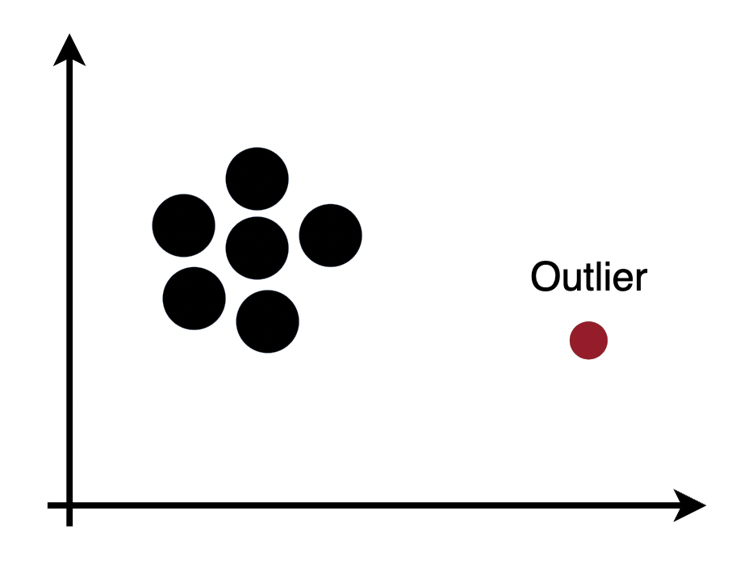

Outlier haben Merkmale, die nicht dem Rest entsprechen - die aber ebenso beachtet werden sollten. Sie zeigen Aspekte auf, die sich keiner Trivialität unterwerfen aber nützlich für die Studie der Domain sind.

Ein Beispiel hierfür ist die ADHS-Forschung, die höchst kompliziert ist und bei der die Wissenschaft seit Jahrzehnten nur stückweit Fortschritte erziehlt. Einen Durchbruch gab es, als Stephen Scherer (Toronto's world-renowed Hospital for Sick Children) Outlier-Daten analysierte. Diese Daten enthielten die nötigen Informationen, um die Krankheit stückweit besser zu erklären.

Grundlegend: Daten, die der Norm enstprechen, sind oft überanalysiert und sie tragen kein Wissen mehr in sich. Daten hingegen, die das eine Prozent ausmachen, das nicht der Norm entspricht, wurden häufig noch gar nicht analyisiert und tragen neue Ansätze für das Ssystem in sich.

# Von Anfang zu Ende - Design Thinking als Prozess
Bei Design Thinking geht es um einen Prozess. Ähnlich wie bei agilen Projekt Management Prozessen wie Scrum nach ISO-13407 gibt es einen Makrozyklus, der aus sich wiederholenden Mikrozyklen entsteht. Die besten Ideen sind nichts wert, wenn wir sie nicht als erfolgreiche Innovation am Markt etabliert haben. IDEO legt mit ihrer Formulierung des Mikrozyklus einen starken Fokus auf die Umsetzung.

Der Mikrozyklus nach der Design- und Innovationsagentur (= IDEO) umfasst folgende inkrementelle Phasen:

- **Verstehen** - Um ein Problem lösen zu können, muss man es erstmal verstehen. Es geht aber nich nur darum die Aufgabenstellung zu verstehen, man möchte den Markt, die KundInnen, die Technologie, die Randbedinungen, die Restriktionen und Optimirungskriterien kennen lernen. 
- **Beobachten** und **Analysiere** - Es geht darum das Verhalten von echten Usern im Bezug auf die Aufgabenstellung zu beobachten.
- **Visualisieren** - Das Visualisieren von Ideen hilft, zu verstehen und zu veranschaulichen. Dazu kommen oft technische Hilfsmittel ins Spiel, wie 3D Software, Simulationen und Prototype.
- **Bewerten** und **Optimieren** - Ein Prototyp ist dazu da Mängel und Verbesserungen zu erkennen und diese zu bewerten und optimieren.
- **Implementieren** - Es geht darum das neue Konzept in die Realität zu schaffen.

Der standatisierte Prozess ergibt sich wie folgt:

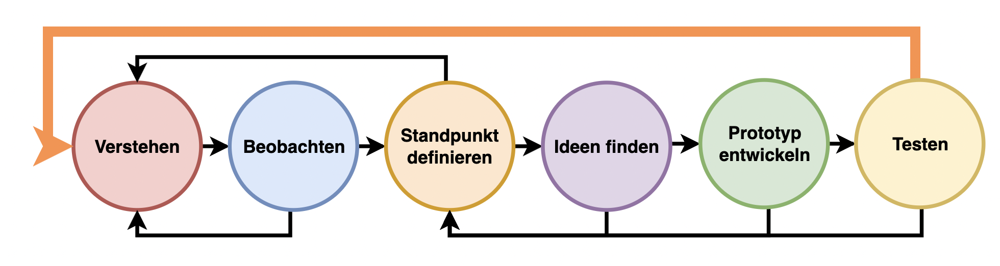

## Verstehen
In dieser Phase ist es wichtig, die Zielgruppe (mittels Persona-Beschreiung) sowie dessen Herausforderungen, Bedürfnisse und Probleme zu versteheh. Von Bedeutung ist es, Kreativität einzusetzen um sich bestmöglich in die Situation der Zielgruppe hineinversetzen zu können. In dieser Phase können speziell zwei Fragearten eingesetz werden:

- **WARUM?** - Warum hat die Zielgruppe das Bedürfnis? Dies erweitert den kreativen Rahmen.
- **WIE?** - Konkrete Lösungsideen. Dies ist eine einengende Frageart, da allgemeine Lösungen gefunden werden.

Weiters könnnen in dieser Phase einige Fragen gestellt werden:

| Frage                                    |
|------------------------------------------|
| Wer ist die Zielgruppe?                  |
| Warum gibt es das Bedürfnis?             |
| Welche Lösungen gibt es bereits?         |
| Wo wird das Ergebnis-Produkt eingesetzt? |
| Wie wird die Lösung implementiert?       |

## Beobachten

## Standpunkte definieren

## Ideen finden

## Prototyp entwickeln

## Testen

## Reflektieren

# Kunden und Problemorientierung - HCD
Design Thinking ist eine mächtige Methode, die auf zwei Säulen basiert:
 - KundInnen
 - und ihre alltäglichen Probleme bzw. Herausforderungen

Es ist wichtig, dass man diese zwei Kritierien zu Beginn des Design Thinking Prozesses versteht und darauf eingeht. Fehlt eine der beiden Säulen macht Design Thinking keinen Sinn. Es geht darum, das Leben für KundInnen zu vereinfachen. Gibt es keine Probleme, so kann man auch nichts lösen.

Es ist eine Falscheinschätzung Design Thinking auf die Idee zu konzentrieren. Aus der Vergangenheit wissen wir, dass Unternehmen, die kein Problem zu lösen versuchen oft kläglich scheitern. Warum? Weil keiner ihr Produkt, ihre Idee, braucht - sie ist überflüsslich und die Nachfrage erlischt komplett.

| Idee                  | Problem                                            | KundInnen                                                      |
|-----------------------|----------------------------------------------------|----------------------------------------------------------------|
| Car-Sharing           | Autos sind teuer                                   | Menschen, die kein Auto haben, aber manchmal ein Auto brauchen |
| Schwangerschaftskurse | Verhalten in der Schwanderschaft ist nicht trivial | Schwangere Frauen                                              |
| Schulen               | Wir brauch eine Basisbildung                       | Kinder und Jugendliche                                         |

Dies kann man zusammenfassen, als **Human Centered Design (= HCD)**. Dabei bildet man die Bedürfnisse der KundInnen ab und gestaletet das Produkt möglichst nutzerfreundlich (User Expirience).

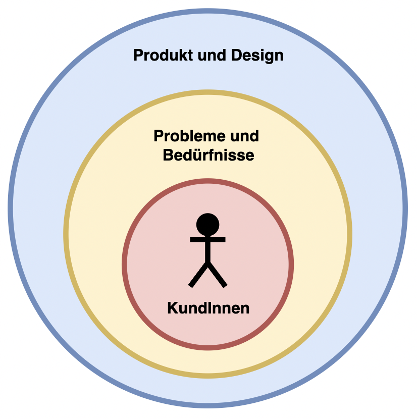

## Lösungen - Von Problemstellungen zu Lösungen
Der Lösungsweg ist keinen falls linear, doch kann man gewisse Phasen erkennen. Man spricht von divergierendem und konvergierendem Denken.

Beim divergierendem Denken geht es darum zu identifizieren, diskutieren, bekannte optionen und unterschiedliche Perspectieven kennen zu lernen. In dieser Phase geht es quasi darum mögllichst viele Ideen und Lösungen zu sammeln. Dann folgt die Phase des konvergiertem Denken. Dabei geht es um priorisieren, auswählen, vereinfachen, konsolidieren. Es geht darum die vielen generierten Ideen zu einer Lösung zu integrieren. Dazwischen gibt es die "Groan Zone", die Phase, die das Umdenken definiert. Diese Zone ist umbedingt zu erkennen, da es der optimale Punkt ist, das Denkverhalten zu ändern. Das Divergieren und Konvergieren dauert mal länger, mal kürzer. Natürlich wiederhohlen  sich diese Phasen immer wieder im Design Thinking Prozess.

## Arten von Problemen

## Well defined problems
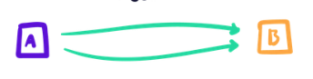

Es gibt ein klares Problem, verschiedene Wege, und eine klare Lösung. Man spricht auch von **blauen Problemen**.

    
### Ill defined problems
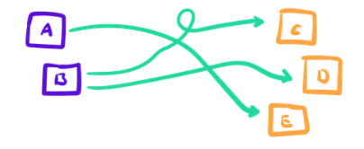

Es gibt ein unklares Problem mit verschiedenen Wegen. Es gibt aber mehrere Lösungen. Auch bekannt als **rote Probleme**

### Wicked problems
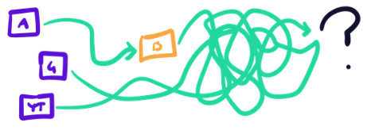

Hier geht es um ein unbekanntes Problem, ein Problem welches man noch nicht erkannt hat. Oft kommt es erst nur zu Teillösungen, um die Problemdefinition zu verschärfen und es dadurch das ill defined problem zu vorschein zu bringen.

Egal um welche Art von Problem es sich handelt, es ist immer wichtig genug Zeit und Ressourcen zu verwenden, um ein möglichst gute Problemdefinition zu erhalten. Es mag oft eine Überwindung sein, da man ja eigentlich eine Lösung finden und kein Problem schaffen will. Um eine gute Lösung zu finden, gibt es aber drei klare Anforderungen:

1. Das Design Thinking Team muss das Problem verstanden haben.
2. Die Design-Challenge muss so definiert werden, dass diese es erlaubt, nützliche Lösungen zu entwickeln
3. Die potenzielle Lösung muss zum definierten Design Space & Scope passen

Um Probleme greifbarer zu machen, reicht es of den kreativen Rahmen zu verkleinern oder manchmal auch etwas zu erweitern, um das richtige Niveau zu erhalten. Wie steuere ich den kreativen Rahmen? Durch die Frage nach dem Warum wird der kreative Rahmen erweitert. Durch die Frage nach dem Wie steuert man auf realistischere Lösungen zu. 

Um diesen Gedankengang besser zu veranschaulichen, ein Beispiel von Umgang mit einem Problem in Zusammenhang mit einem Dosenöffner.

Wen wir nach dem Wie fragen:

- Wie kann durch einen Drehmechanismus die Dose geöffnet werden?
- Wie kann die Dose ohne zusätzliches Hilfsmittel geöffnet werden?

Un jetzt die Frage nach dem Warum:
- Wie können wir den Welthunger stoppen?
- Wie könnten wir verhindern, dass so viele Lebensmittel weggeworfen werden?

Man erkennt sofort, dass man durch Warum fragen schnell an die Grenzen der Komfortzone gebracht wird. Das eigentliche Problem ist bei solchen Wicked Problems nicht mehr offensichtlich. Die Wie fragen helfen das Problem mehr greifbar zu machen.

## Innovation und Ideengenerierung

Nachdem wir Probleme geklärt haben, geht es jetzt um Ideen um diese zu Lösen. Wie generieren wir Ideen? Es ist klar, dass die meisten bahnbrechenden Ideen nicht nur während einem Brainstorming entstehen. Was entscheidet die Quantität unserer Idee?

Kreative Firmen lassen ihren MitarbeiterInnen möglichst viel Freiraum, da dies ein kreatives Denken fördert. Manche Firmen führen sogar Tage ein wo jeder machen kann was er oder sie will und dann rückmeldet was erreicht wurde. Der Erfolg dieser Firmen zeigt uns, dass innovative Ideengenerierung durch zielgerichtete kreativität gefördert werden kann. 

Trotzdem schreckt es viele Vorgesetzte, wenn MitarbeiterInnen erklären, dass sie die nächsten vier Stunden im Pausenraum verbringen, mit der begründung dadurch Ideen zu finden. Es braucht daher konkrete Methoden und Tools der struktuierten Ideenfindung. 

### Brainstormings
Ein Brainstorming kann nicht beginnen, wenn nicht alle einmal gelacht haben. Es geht darum eine lockere und entspannte Atmosphäre zu schaffen, die kreatives Denken ermöglicht. Wichtig ist zu verstehn, dass es bei Brainstormings nicht darum geht Lösungen zu finden, sondern Ideen zu generieren. Deshalb gibt es einpaar Regeln, die ein erfolgreiches Brainstorming ausmachen:

- **Kreativer Mut**: Teilnehmer müssen alle Ideen äußern, die ihnen in den Sinn kommen, auch wenn sie auf den ersten Blick irrelevant erscheinen. Andere könnten dann auf dieser Idee aufbauen. Um kreativen Mut zu schaffen, sind vor allem Hierarchiestrukturen hinderlich. Als Neuling möchte man sich natürlich einen guten Eindruck beim Chef hinterlassen. Experten im Bereich Design-Thinking sind sich überaus einig, dass eine Vorstellrunde in einem Brainstorming ein No-Go ist. Noch besser ist, wenn sich die Teilnehmer überhaupt nicht kennen. Fokus sollte auf der Ideenfindung liegen, nicht darauf sich zu beweisen. Jeder kann Ideen liefern, egal, welche Funktion und Rolle er oder sie hat.
- **Quantität vor Qualität**: Beim Brainstorming ist es wichtig eine divergierende Denkphase zuzulassen. Es geht in erster Linie darum, möglichst viele Ideen zu sammeln. Zum Sortieren und Entscheiden bleibt später noch genug Zeit. Sich für die erste Lösung zu entscheiden, ist natürlich verlockend, man muss sich aber immer vor Augen halten, dass die viel bessere Lösung nur 5 Minuten Brainstorming entfernt ist.
- **Keine Kritik an Ideen**: Ideen finden, und Ideen diskutieren muss möglichst separate. Wie bereits erwähnt erfolgt die Beurteilung in einem separaten Schritt.

Bereits zum Beginn eines Brainstorming haben alle TeilnehmerInnen bereits eine triviale Lösung im Kopf. Doch dabei handelt es sich eigentlich nie um eine innovative Idee. Hier kann ein sogenannter "Brain Dump" helfen. Dabei laden alle Beteiligten ihre Idee ab, sodass sie offen für neues sind. Dann geht es los "wilde" Ideen zu finden. Dazu folgender Trick:
1) **Wettbewerb**: Größere Runden lassen sich in kleinere Teams einteilen, die dann untereinander Ideen finden. Nach Halbzeit gibt es dann einen kleinen Wettbewerb, in dem jede Gruppe ihre Ideen präsentiert. Der springende Punkt ist aber, die Ideen nicht nach qualität zu bewerten, sondern nach quantität. Das Team mit den meisten Ideen gewinnt. Die einzelnen Teams erhalten dadurch ansporn kreative Leistungen zu erbringen. Außerdem wird erkannt, wenn einzelne Gruppen mit der Quantität weit zurückliegen. Oft liegt es daran, dass sie sich auf Diskussionen und Kritik an Ideen eingelassen haben. So gibt es sogar einen natürlichen selbstkritischen Kreislauf.
2) **Präsentieren**: Anschließend soll jedes Team ihre zwei besten und ihre zwei dümmsten Ideen vorstellen. Das führt einerseits zu viel gekicher und hebt somit die Stimmung, führt aber auch zu einem Neuwert, wenn wir es schaffen genau diese Ideen ins Positive zu drehen. In jeder Idee steckt Potenzial.

### Kopfstandmethode
Bei der Kopfstandmethode geht es nicht um Sport, es geht darum, die Fragestellung umzudrehen. Statt "Wie fördere ich Kreativität in meinem Unternehmen?", heißt es dann "Wie verhindere ich Kreativität in meinem Unternehmen?". Alle Teilnehmer haben dann die Möglichkeit ihre kreativität zu nutzen, um sich über ein Thema lustig zu machen. Im Anschluss geht es dann darum die Ideen wieder umzudrehen und so eine Idee für die originale Fragestellung zu generieren. Diese Methode ist vor allem geeignet, um Dienstleistungsabläufe zu überdenken und zu verbessern. Bei Produkten ist die Kopfstandmethode meist besser um Anforderungen zu erstellen, anstatt Ideen zu finden.

Nachdem wir reichlich Ideen generiert haben kommt es zur **Auswahl der Ideen**. Bevor man eine Entscheidung trifft, einigt man sich erst auf Ideen, die man weiter verfolgen möchte. Dazu gibt es sehr viele Möglichkeiten. Hier einpaar beispiele:
- Punktbewertung: Jeder hat eine gewisse Anzahl an Stimmen und kann diese auf die Ideen aufteilen. Die Ideen mit der besten Bewertung werden weiterverfolgt.
- Nur Ideen mit Neuigkeitswert werden weiter verfolgt.
- Ideen werden in ein Diagramm mit mehreren Achsen, wie "Cool" und "Machbar", eingeteilt. Es werden anschließend zwei oder mehr Ideen ausgewählt, diese müssen aber nicht zwangsläufig in der Mitte oder am Rand sein. Die Einteilung nach gewissen charakteristiken führt oft zu neuer Erkenntnis und Verbesserungen.
- Beim **Clustering** geht es darum, Ideen nach Themen und Überbegriffen zu gruppieren. Das versichert, dass alle die Ideen richtig verstehen.

# Personas
## Persona erstellen
Um eine Persona zu erstellen, muss man den typischen Nutzer als "reale Person" darstellen. Um wie wahren Bedürfnisse herauszufinden, werden oft auch Skizzen von potenziellen Nutzern erstellt. Mit diesen wird dann überprüft, ob es solche Nutzer bereits in der realen Welt gibt. Damit man nun die passenden Präferenzen und Bedürfnisse des Nutzers bekommt, muss man Einblicke in die "deep insights" bekommen.
Für diese Einblicke gibt es Workshops, in denen Canvas-Modelle eingesetzt werden. Ein Beispiel dafür wäre das "User Profile Canvas", in dem eine lebensgroße Person auf ein Plakat gezeichnet wird und mit Bildern, Fotos, Zitaten, etc. geschmückt wird. Diese wird dann schrittweise verbessert, indem versucht wird, das eigentliche Problem zu finden. Ähnlich zu diesem Vorgang wird es auch bei Profilern, die man aus Krimiserien kennt, gemacht.
- Zeitintensiv (Standardpersonas --> Zeitsparender, aber auch risikoreicher)
- Empathie mit Nutzer aufbauen

### User Profile Canvas
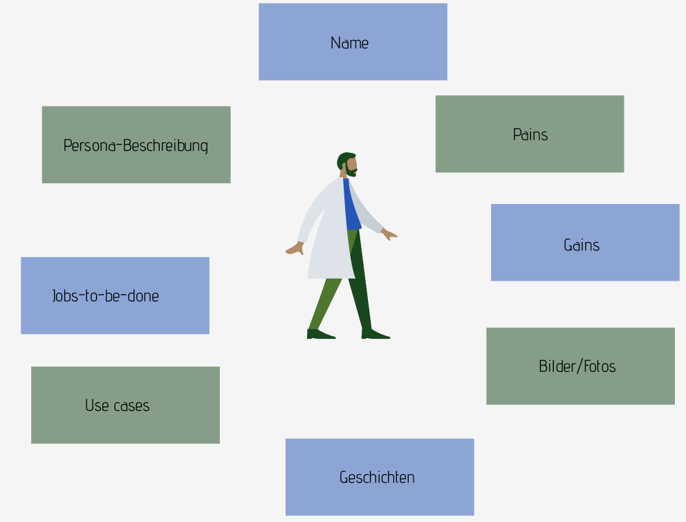
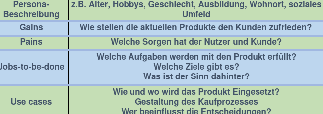
### Empathie Map
Um Empathie zu einem potenziellen Nutzer aufzubauen, benötigt man als erstes einen Entwurf einer Persona. Dabei hilft Brainstorming, aber auch Informationen von Interviews, realen Personen und Beobachtungen. Um nun Empathy zum potenziellen Nutzer aufzubauen, trifft man sich und dokumentiert alle Erkenntnisse. Um Empathie zu erlangen, kann auch die Empathie Map angewandt und befüllt werden. Die davon erlangten Erkenntnisse müssen wiederum analysiert und in eine Persona eingesetzt werden.
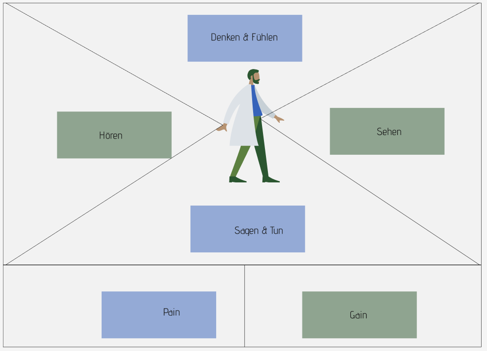

## Persona überprüfen
Um Erkenntnisse über den Nutzer zu erlangen, wird die AEIOU-Methode verwendet. Hierfür muss man mit den potenziellen Nutzern sprechen und versuchen, sie nachvollziehen zu können. Dabei kann der AEIOU-Fragebogen ein gutes Hilfsmittel sein, um Information zu erlangen. Außerdem kann man durch das Überschreiten dieser Hemmung, fremde Personen anzusprechen, ein "Needfinding-Experte" werden.
- Activities (Aktivitäten)
  - Was passiert?
  - Was machen die Personen?
- Environment (=Umgebung)
  - Wie sieht das Umfeld aus?
  - Charakter und Funktion des Raums?
- Interaction (=Interaktion)
  - Wie agieren die Systeme miteinander?
  - Wie agieren die Benutzer untereinander?
  - Schnittstellen?
- Objects (=Objekte)
  - Welche Gegenstände und Geräte werden benutzt?
  - Wer benutzt die Gegenstende wo?
- User (=Benutzer)
  - Wer sind die Benutzer?
  - Welche Rolle nehmen sie ein?
  - Wer beeinflusst sie?

## Schritte einer Persona-Entwicklung
1. Finde den Nutzer
- Wer sind die Nutzer? Wie viele Nutzer gibt es?
- Quantitative Sammlung von Daten, AEIOU-Methode
2. Baue eine Hypothese auf
- Wie unterscheiden sich die Nutzer?
- Beschreibung der Gruppierungen von gleichen Nutzen/Segmentieren
3. Bestätigungen
- Gibt es Daten oder Belege, welche die Hypothese bestätigen?
- Quantitative Sammlung von Daten, Emapthie Map
4. Finde Muster
- Stimmen die ersten beschreibungen der Gruppierungen noch?
- Kategorisierung, Anwendung Job-to-be-done Framework
5. Erstelle Personas
- Wie kann die Persona beschrieben wernden?
- Kategorisierung, Persona
6. Definiere Situationen
- In welcher Situation hat die Persona welchen Anwendungsfall?
- Nach Situationen und Bedürfnissen suchen, User Profile Canvas
7. Validierung
- Kennen Sie so eine Person?
- Befragung von Personen, lesen von Persona-Beschreibung
8. Wissensverbreitung
- Was passiert, wenn die Persona die Technologie nutzt?
- Storytelling, Anwendung Hook Canvas, etc.
9. Erstelle Szenarien
- Wer sind die Nutzer? Wie viele Nutzer gibt es?
- Quantitative Sammlung von Daten, AEIOU-Methode
10. Stetige Weiterentwicklung
- Gibt es neue Informationen?
- Usability Test, kontinuierliche Überarbeitung der Persona

# Teams
Teams sind ein wesentlicher Bestandteil in der Arbeitswelt. Bei Mitgliedern gibt es zwei sehr relevante Dimensionen: tiefes Fachwissen und Allgemeinwissen. Wichtig ist auch Know-how und Erfahrung in einem Themenbereich. Ein funktionierendes Team hat ein ganzheitliches Denken. Es gibt keine limitierende Perspektive, das vielseitige Team betrachtet Themen aus allen Richtungen gleichzeitig. Ein relevantes Modell, welches hilft zu Bewerten, ob ein Team für Design-Thinking geeignet ist, ist das **Prinzip der T-Shaped People** von Dorothy Leonard-Barton.

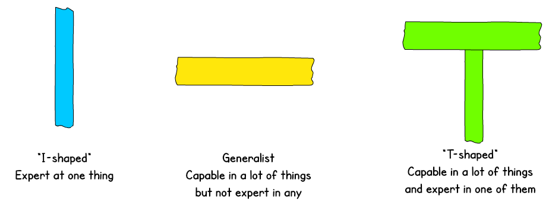

Der vertikale Balken des T-Profils steht für fachliche kompetenz, spezialisiert in einer Disziplin, einem System oder einer Kultur. Der horizontale Balken überstreckt sich über zwei Eigenschaften. Einerseits die Empathie, also wie sehr eine Person in andere hinein fühlen kann. Dann gibt es noch die Kollaborationsfähigkeiten. Dazu zählen Offenheit, Interesse und Neugier. 

Personen mit T-Proil sind die beste Wahl für ein Team mit sowohl tiefem, als auch breitem Wissen. Der horizontale Balken bildet die Brücke zwischen verschiedenem Fachwissen. So entsteht ein interdisziplinäres Team, welches aufgrund, iterativen Abstimmungen zu besserer Qualität des Gesamtergebnisses führt. Damit ein interdisziplinäres Team aber ein gemeinsames Ziel verfolgen kann, braucht es einige Regeln:

1) Das Team hat eine gemeinsame Vision.
2) Themen, die im Design-Thinking Prozess auftreten, werden immer vom passendem Fachexperten geführt.
3) Das Team einigt sich auf gemeinsame Werte.
4) Es gibt eine Atmosphäre des Vertrauens.
5) Prozesse sind gemeinsam durchzuführen, sodass jeder stets das Vorgehen versteht.
6) Nachvollziehbares Feedback ist notwendig für Verbesserung 

Neben dem T-Model, ist auch das **Metaphorisches Modell** relevant für die Zusammenstellung von Teams. Dieses beschreibt unser Gehirn in vier physiologischen Hirnstrukturen wie folgt:

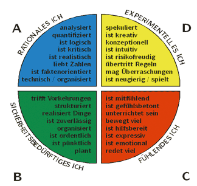

Es kann hilfreich sein, sich offen im Tem über die verschiedenen Denkpräferenzen auszutauschen, und Aufgaben den Erkenntnissen nach aufzuteilen. Dieser Austausch fördert ein Verständnis unter den Teammitgliedern. Dadurch kann jeder seine oder ihre Stärken ausspielen und es kommt so schlussendlich zu besseren Lösungen.

Zusammengefasst ist also vor allem die Heterogenität eines Teams Qualitätsrelevant. Man achtet auf ausgewogene fachlich relevante Perspektiven und persönlichkeitsbezogene Ansichten. Die unterschiedlichen Herangehensweisen, Denkpräferenzen und Hintergrundwissen fürder die Kreativität des Teams als kleinste Einheit.     

# Mindset und Future Driven - Vorbereitung
David

# Scrum
Scrum ist eine agile Projektmanagement Technik (ISO 13407), die auf Methoden des Design Thinkings basiert. Dabei wird das Projekt in Sprints, also Feedback Schleifen mit dem Kunden, unterteilt.

Vorgehen:

- In dem **Kickoff-Meeting** werden alle Produktfeatures, die der Kunde will, zusammen mit deren Benefit (= Value) aufgenommen und unterteilt.
- Jedes Feature wird in Form einer **User-Story** beschrieben: "Als <Benutzer>, will ich <Feature>, sodass <Value>". Dies hilft dabei, die **Definition of Done** eines Features zu dokumentieren, denn ein Feature gilt dann als erledigt, wenn der Benutzer entsprechend der User-Story das beschriebene Value erreichen kann.
- Die User-Stories werden in dem **Product-Backlog** eingeordnet und nach Priorität und Implementierungs-Reinfolge geordnet. 
- Danach beginnen die **Sprints**, die allesamt Mikrozyklen darstellen (mit einer Dauer von 1-4 Wochen) und aus folgenden Phasen bestehen:
  - Ein Spring-Backlog wird erstellt
  - Das Team sucht sich die User Stories, die sie in dem Sprint Implementieren wollen, aus dem Product Backlog und ordnet sie in den **Sprint Backlog** ein
  - Jeden Tag gibt es ein **Daily Standup Meeting**, wo alle Teammitglieder kurz und knapp erzählen, WAS sie gemacht haben, WAS sie machen werden und ob sie etwas brauchen
  - Nach dem Sprint findet das **Sprint Review** statt, wo das Team mittels eines kurzen Workshops herausarbeitet, was gut und was schlecht gelaufen ist und wie man dies verbessern kann
  - Hat das Team seine Leistung und interne Teamdynamik beurteilt, findet die **Sprint Retroperspective** zusammem mit dem Kunden statt. Dabei wird das erreichte Value präsentiert und womöglich sofort an die User im bestehenden Produkt ausgeliefert (= **Continuous Delivery**).

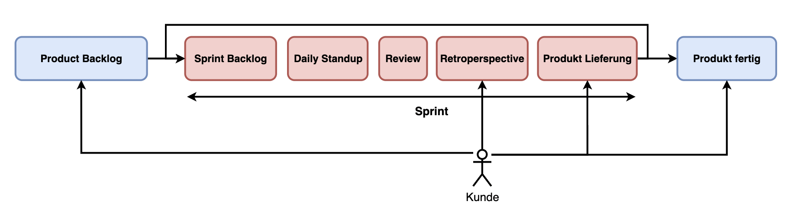

Scrum bedeutet dass das Team agil ist. Einwände und Wünsche vom Kunden können auch noch während des Projekts berücksichtigt werden, ohne Requirements grundlegnd neu zu definieren: Flexibilität. Die Arbeit in Sprints führt zu einem regen und engen Austausch mit dem Kunden, wodurch das Produkt stets in die richtige Richtung verläuft. Auch wird in jedem Sprint ein **Value Increment** erziehlt, was bedeutet, dass das Produkt nach jedem Sprint wächst - es wird immer entwicklet und die Planungszeit verteilt sich gelichmäßig auf das Projekt.

# Apple als Beispiel

> “Most people make the mistake of thinking design is what it looks like. People think it’s this veneer — that the designers are handed this box and told, ‘Make it look good!’ That’s not what we think the design is. It’s not just what it looks like and feels like. Design is how it works.” — Steve Jobs

Apple unter Steve Jobs war ein Gigang im Design Thinking. Eine Erfolgsstory nach der anderen - und alles begründet durch strategisches und keatives Design Thinking. Der iPod, das iPhone, der iPad - Innovation um Innovation. Hier stellt man sich der Frage, wie es Apple schafft, mit jedem neuen Produkte, genau die Wünsche und Bedürfnisse der KundInnen abzubilden - und jedes Mal ins Schwarze zu treffen.

Dies ist sofort erkennbar, wenn man auf Apple's Mac Evolution blickt:

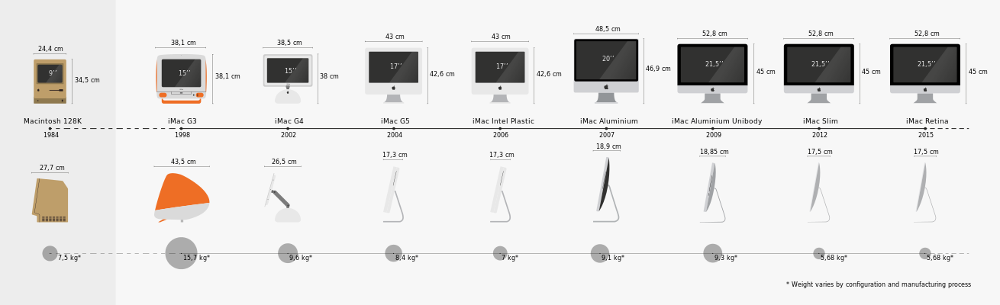

> Think Different. Connect the dots.

Wie schafft es Apple einen so guten Zugang zu seinen KundInnen zu haben, der sich im Design und den Produkten findet?

- **Design over-engeneering** - Das Design muss perfekt sein.
- **Simplicity** - Weniger ist mehr.
- **Exzellente Verarbeitung und Ausführung** - Vom Material bis zur Software: Alles muss passen.
- **Kundenzufriedenheit** - Der Kunde steht im Mittelpunkt.
- **Die richtigen Leute** - Konstruktivismus und ständiges Lernen - Freiraum für die Kreativität
- **Feedback Loops** - Ständiger Austausch mit den KundInnen
- **Product Strategy** - Alle Produkte funktionieren mühelos miteinander

# Zusammenfassung
Beim Design Thinking geht es daraum, seine KundInnen und ihre Probleme zu verstehen. Erfolgreiche Organisationen setzen genau hier an und entwickeln maßgeschneiderte Lösungen, die stets verbessert und an KundInnen getestet werden. Allen voran gilt es seine Kreativität einzusetzen und Out-of-the-Box zu denken, um Innovation voranzutreiben. Wissen sollte generiert werden, aus dem sich Hypothesen ableiten lassen, die zu definierten Algorithmen werden. Also braucht eine Organisation beide Seiten: kreative Innovation und analytisches prozessorientiertes Denken - um Erfolg zu haben.

# Sources
- Design Thinking Playbook von Michael Lewrick, Patrick Link und Larry Leifer
- https://designthinking.ideo.com/
- https://www.franchiseverband.com/wissen/franchising-definition#:~:text=Franchising%20ist%20ein%20auf%20Partnerschaft,gegen%20eine%20Geb%C3%BChr%20nutzen%20d%C3%BCrfen.
- Roger L. Martin (November 2009). The Design of Business. Harvard Business Press.
- https://en.wikipedia.org/wiki/The_Design_of_Business
- http://www-management.wharton.upenn.edu/pennings/documents/March_1991_exploration_exploitation.pdf
- https://medium.com/macoclock/how-apple-used-design-thinking-38afb6770a6
- https://www.atlassian.com/de/agile/scrum
