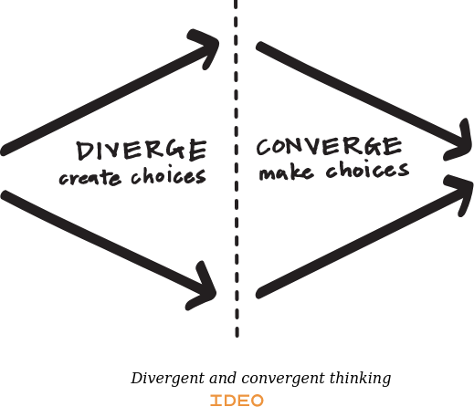

# Buzzwords
## Das Design Thinking Framework
Problemdefinition
Bedürfnisse von Nutzern
Empathie zum Nutzer
richtiger Fokus
generieren von Ideen
Prototypen
Testen
## Erfolgsfaktoren
kreative Räume und Umgebungen
interdisziplinäre Teams
Storytelling
Mindset
## Zukunft
Lean
Implementierung
Design Thinking in der Digitalisierung

# Design- und Innovationsagentur IDEO

# Die Welt voller Design Thinking - Integration von Design Thinking in unsere Welt
Wir leben in einer Welt voller komplexer und komplizierter Abläufen, die sich gegenseitig beeinflussen und somit Systeme entstehen. Unternehmen und soziale Konstrukte wachsen so schnell wie noch nie und durch die rasche Änderung unserer Gesellschaft durch Globalisierung braucht es konstant geschickte Entscheidungen, um sich an rasche Änderungen anpassen zu können. In unserer digitalen Welt geht nicht darum sich in eine Situation einzubauen - viel mehr geht es darum sich an die Änderung der Situation anzupassen. Design Thinking ist nicht klar definiert. Klar ist aber, dass es um Nutzen von Kreativität geht, um die großen Probleme unserer Zeit zu lösen. Die Lösung der Problemstellung steht im Vordergund. Es ist eine Idee, Methode und Strategie, die Welt aus neuen Blickwinkeln zu betrachten und so komplexe Konzepte zu durchschauen. Es ist kein einfacher Weg, noch ist es ein Weg der immer funktioniert, aber doch scheint Design Thinking seine Relevanz uns seinen Einfluss in der heutigen Welt bestätigen zu können.

# Organisationen und Design Thinking
Wenn es darum geht, durchwachsene Organisationen solide auzubauen, ist es wichtig, eine der Kernchallenges zu verstehen, um darauf zielgerechte Lösungsstrategien anzuwenden. Unternehmen setzen sich in der Regel das Ziel zu skalieren, was durch Produktinnovation und Prozessoptimierung aus -ausfahrung funktioniert. Auf der einen Seite gilt es neue Produkte für zeitrelevante Probleme zu finden - andererseits geht es aber genauso darum, bestehende Produkte und Abläuft so zu verbessern dass sie zu einer besseren Gewinnstellung und zu einem konstanten Wachstum des Unternehmens führen. Zusammengefasst geht es also um:
- analytisches Denken (Prozessoptimierung)
- kreatives Denken (Produktinnovation und organisationelle Innovation - Wandlung und Chancen)

McDonald's als Beispiel für organisationelle Revolution:
Das amerikanische Burgerunternehmen hat klein begonnen. Die Köche haben gekocht wie in jedem anderen Burgerunternehmen auch. Doch McDonald's fand einen großen Kundenstrom, der die Basis für seine Skalierung und Expansion war. Unter anderem wegen dem Franchise-Modell hatte McDonald's Erfolg. Wenn man das Beispiel klarer betrachte, so fällt auf dass es einige Faktoren gab, die maßgeblich zu seinem Erfolg beigetragen haben:
- Prozesse, wie das Kochen von Burgern wurde so stark standatisiert, dass Köche keinen Spielraum für Fehler oder andere individuelle Änderungen mehr hatten, was zugleich bedeutet, dass die KundInnen immer den selben Burger bekommen
- Durch kreatives Denken wurden neue Abläufe und Produkte geschaffen

Dieses Beispiel zeigt, dass ein Unternehmen also auf zwei Pfeilern aufgebaut werden sollte, um zu skalieren und Innovation voranzutreiben. Die erste Säule, analytisches Denken, stellt einen quantitativen Prozess dar, der zielgerichtet jegliche Form von Veränderungen und Variation eliminiert. Die zweite Säule, kreatives Denken, beschreibt grundlegende Denkweisen nach den Prinzipien des Design Thinkings - es handelt sich um eine intrinsische und kreative Suche nach Innovation. 

# Der Knowledge Funnel
Da beide Denkweisen (analytisch und kreativ) substanziell für Unternehmen sind, sollten sie praktiziert werden. Der Knowledge-Funnel ist eine schematische Darstellung der Wissensgenerierung in einem Unternehmen und bildet die Transformation von Problemen zu strukturierten und ablaufsorientierten Lösungen ab:

Bei dem Knowledge Funnel handelt es sich um einen iterativen und sich wiederholenden Prozess, der folgende Phasen beinhaltet:
- "Mystery": Hier geht es darum, das ursprüngliche Problem anzugreifen und durch erste Recherche und Studien, Wissen daraus zu generieren. Dieses Wissen ist stark unstrukturiert.
- Heuristiken: Um das Wissen der letzten Phase nutzen zu können, müssen Strukturen und andere Zusammenhänge in dem generierten Wissen gefunden werden. Daraus entstehen wage Daumenregeln, die aber das Wissensspektrum auf die relevanten Informationen beschränken.
- Algorithmen: Um das Problem zu vereinfachen, werden die zuvor gewonnnen Heuristiken nun in klar definierten Abläufe (= Alogrithmen) transformiert, sodass man das generierte Wissen ausschöpft und daraus praktikable Strukturen gewinnt, die auf die Organisation angewandt werden können.

Die Kraft dieses Werkzeugs zeigt sich in seiner Anwendbarkeit. Unternehmen können in jeglichen Bereichen Wissen generieren und daraus Algorithmen entwerfen, die sich anbieten und komplex sind. Generell gibt es zwei Domains, in denen stetig Innovation vorangetrieben werden kann:

Beispiele:
- Produktinnovation: Neue Produkte werden entworfen oder bestehende Produkte werden verbessert
- Strukturinnovation: Innovation organisationelle Abläufe in verschiedenen Abteilungen (veraltete Denkweise) und Teams (neue Denkweise); häufig sind genaue Algorithmen nicht das Ziel - vielmehr geht es daraum, neue wissenschaftliche Erkenntnisse zu erhalten

Dementsprechend, können sich Unternehmen zeitgleich in verschiedenen Knowledge Funnels befinden, um maximalen Mehrwert für die KundInnen und die Organisation zu bringen:

## Datenanalyse

## Exploration und Exploitation

# Von Anfang zu Ende - Design Thinking als Prozess
Bei Design Thinking geht es um einen Prozess. Ähnlich wie bei agilen Projekt Management Prozessen wie Scrum nach ISO-13407 gibt es einen Makrozyklus der aus sich wiederholenden Mikrozyklen entsteht. Die besten Ideen sind nichts wert, wenn wir sie nicht als erfolgreiche Innovation am Markt etabliert haben. IDEO legt mit ihrer Formulierung des Mikrozyklus einen starken Fokus auf die Umsetzung.

Der Mikrozyklus definiert sich wie folgt:
- **Verstehe** - Um ein Problem lösen zu können, muss man es erstmal verstehen. Es geht aber nich nur darum die Aufgabenstellung zu verstehen, man möchte den Markt, die Klienten, die Technologie, die Randbedinungen, die restriktionen und Optimirungskriterien kennen lernen. 
- **Beobachte** und **Analysiere** - Es geht darum das Verhalten von echten Usern im bezug auf die Aufgabenstellung zu beobachten.
- **Visualisiere** - Das visualisieren von Ideen hilft, zu verstehen und zu veranschaulichen. Dazu kommen oft technische Hilfsmittel ins Spiel, wie 3D Software, Simulationen und Prototype.
- **Bewerte** und **Optimiere** - Ein Prototyp ist dazu da Mängel und Verbesserungen zu erkennen und diese zu bewerten und optimieren.
- **Implementiere** - Es geht darum das neue Konzept in die Realität zu schaffen.

# Lösungen - Von Problemstellung zu Entscheidung
Der Lösungsweg ist keinen falls linear, doch kann man gewisse Phasen erkennen. Man spricht von divergierendem und konvergierendem Denken.

Beim divergierendem Denken geht es darum zu identifizieren, diskutieren, bekannte optionen und unterschiedliche Perspectieven kennen zu lernen. In dieser Phase geht es quasi darum mögllichst viele Ideen und Lösungen zu sammeln. Dann folgt die Phase des konvergiertem Denken. Dabei geht es um priorisieren, auswählen, vereinfachen, konsolidieren. Es geht quasie darum die vielen generierten Ideen zu einer Lösung zu integrieren. Dazwischen gibt es die "Groan Zone", die Phase, die das Umdenken definiert. Diese Zone ist umbedingt zu erkennen, da es der optimale Punkt ist denkverhalten zu ändern. Das Divergieren und Konvergieren dauert mal länger, mal kürzer. Natürlich wiederhohlen sie sich immer wieder im Design Thinking Prozess.  

# Arten von Problemen
## Well defined
## Ill defined
## Wicked problems

# Innovation und Ideengenerierung

# Mindset

# Future driven

# Testing

# Mind your decisions

# Estimation

# Lean Geschäftsmodell

# Sources
- Design Thinking Playbook von Michael Lewrick, Patrick Link und Larry Leifer
- https://designthinking.ideo.com/
- https://www.franchiseverband.com/wissen/franchising-definition#:~:text=Franchising%20ist%20ein%20auf%20Partnerschaft,gegen%20eine%20Geb%C3%BChr%20nutzen%20d%C3%BCrfen.
- 